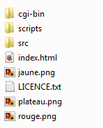

% Le jeu de puissance 4 : Programmation web en Python
% Étape 1 : Mise en place de l'environnement de développement
% Seconde - 2ISN

Dans cette première étape, nous allons installer et organiser notre espace de travail : dossiers, fichiers et logiciels nécessaires à la réalisation de notre projet.

# Quelques explications

Pour développer notre projet, plusieurs logiciels sont nécessaires :

-   Un navigateur internet, de préférence Firefox, doit être disponible pour tester la page HTML du jeu.
-   L'éditeur de texte Notepad ++ sera utilisé pour écrire le code HTML et le code Python du jeu.
-   Une bibliothèque de scripts, nommée Brython sera utilisée : c'est elle qui interprètera les algorithmes que nous allons prohrammer en Python afin qu'ils interagissent avec la page HTML.

# Téléchargement de l'environnement de développement

Afin de mettre en place les fichiers nécessaires à notre travail, il suffit de télécharger l'archive ZIP en cliquant sur l'image ci-dessous.

Cette archive doit ensuite être décompressée : un dossier "projet" est créé.

Ce dossier contient trois sous-dossiers : ce sont les fichiers de la bibliothèque Brython, le "moteur" de notre future page web. Nous n'avons pas besoin d'y accéder. 

Il contient également un ficher HTML : c'est ce fichier que nous allons éditer et qui contiendra notre jeu.

Les trois images fournies sont celles qui seront utilisées par le jeu : 

  

# Édition des document HTML et Python

Pour coder notre jeu, nous utiliserons deux fichiers :

+ le fichier `index.html` contiendra le code HTML nécessaire à l'affichage de la page dans le navigateur ; 
+ le fichier `puissance4.py` contiendra le code Python du jeu.

Ces deux fichiers seront édités dans le logiciel *notepad++*.

Si ce logiciel n'est pas installé, il est disponible en version portable en cliquant sur l'image ci-dessous :

A chaque modification de l'un des deux fichiers, pour observer l'effet de la modification, on veillera à : 

1. Enregistrer les deux fichiers.
2. Rafraîchir l'affichage de la page web dans le navigateur (touche F5).

<nav>
<ul class="pager">
<li><a href="puissance4_0.php">Étape précédente</a></li>
<li><a href="puissance4_2.php">Étape suivante</a></li>
</ul>
</nav>