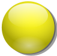

% Le jeu de puissance 4 : Programmation web en Python 
% Étape 2 : La partie HTML du projet
% Seconde - 2ISN

Cette deuxième étape a pour objectif de mettre en place la structure de la page web du jeu Puissance 4.

# La page HTML de départ

Ouvrir le fichier `index.html` dans Notepad++ **et** dans la navigateur web.

Pour l'instant, son contenu est le suivant : 

<pre class="brush: html;">
		&lt;html>
			&lt;head>
				&lt;meta charset="utf_8">
				
			&lt;/head>
			&lt;body onload="brython()">
				

					<h1>Puissance 4</h1>			
				

			&lt;/body>
		&lt;/html>
</pre>

-----------------------------------

**Explications :**

- La ligne 4 fait référence à la librairie `brython.js` : il s'agit d'un ensemble de fonctions écrites dans le langage javascript qui permettent d'insérer du code en Python dans une page HTML.
- Ligne 6 : l'instruction `onload="brython()"` exécute la fonction `brython()` du fichier `brython.js` dès que la page HTML est chargée par le navigateur : le code Python inclus dans la page est donc exécuté automatiquement.

-----------------------------------

# Mise en place des images

Nous allons inclure les images des pions rouges et des pions jaunes et réserver un emplacement pour l'image du plateau de jeu.

Insérer le code suivant juste sous la ligne commençant par `<h1>` : 

<pre class="brush: html;">

<canvas id="jeu" width="602" height="516"></canvas>

</pre>

-----------------------------------

**Explications :**

- Lignes 1, 3 et 5 : on reconnaît la balise `img` permettant l'insertion d'une image. Le paramètre `width` permet de fixer la largeur de l'image affichée par le navigateur. On remarque ligne 5 une étrangeté : la largeur de l'image est fixée à 0. L'image du plateau ne s'affiche donc pas. La ligne 5 permet néanmoins de donner un identifiant à l'image du plateau grâce au paramètre `id="plateau"`. Cela va permettre de faire référence à cette image le moment venu.
- Pendant une partie de puissance 4, l'image du plateau est modifiée : des pions sont ajoutés dans les colonnes. C'est pour cette raison que l'on ne peut pas insérer l'image du plateau directement avec la balise `img` dans le code HTML. Cette image sera ultérieurement insérée dans le `canvas` créé par la ligne 2. Un `canvas`, dans le langage HTML est un conteneur graphique dans lequel on peut afficher des images, des boutons, ..., et interagir avec eux ou les modifier en utilisant un langage de programmation (en général javascript, mais Python pour nous). La balise `canvas` est donc bien adaptée pour contenir l'image du plateau et permettre de la modifier au fur et à mesure du jeu.

-----------------------------------

# Premiers éléments d'interactivité

Avant de passer à la programmation, nous allons déjà ajouter à notre page une petite amélioration qui rendra son utilisation plus agréable.

Les images des pions rouges et jaunes seront les emplacements où les joueurs devront cliquer pour faire glisser leurs pions dans la grille. Pour plus d'interactivité, nous allons définir des *styles* CSS particuliers pour ces images afin qu'elles soient toujours grisées, sauf lorsque l'utilisateur les survole avec la souris.

Essayer ci-dessous : 

Pour cela, ajouter les lignes suivantes dans le fichier `index.html` : 

<pre class="brush:html;">

</pre>
	
-----------------------------------

**Explications :**

- Les lignes 2 et 4 indiquent que les images des pions rouges et jaunes doivent être à moitié transparentes par défaut.
- Les lignes 3 et 5, grâce au mot-clef `hover`, indiquent que ces images doivent être entièrement opaques quand elles sont survolées par la souris.

-------------------------------------

A la fin de cette étape, voici à quoi doit ressembler votre page HTML dans le navigateur : 

<nav>
<ul class="pager">
<li><a href="puissance4_1.php">Étape précédente</a></li>
<li><a href="puissance4_3.php">Étape suivante</a></li>
</ul>
</nav>