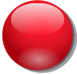
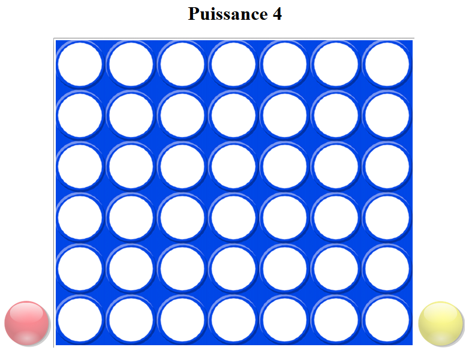

% Le jeu de puissance 4 : Programmation web en Python 
% Étape 3 : Quelques définitions techniques ...
% Seconde - 2ISN

Dans cette troisième étape, nous allons commencer à introduire du code Python dans notre page HTML.

# Mise en place du plateau de jeu

La poursuite du projet nécessitera essentiellement de la programmation en Python.

Nous allons donc créer (dans le même dossier que le fichier `index.html`) un fichier `puissance4.py` dans lequel nous écrirons au fur et à mesure de l'avancement du projet tout le code Python nécessaire.

Pour insérer ce code Python dans la page HTML, ajouter la ligne suivante dans le fichier `index.html`, juste avant la balise fermante `<\body>` : 

<pre class="brush: html;">

</pre>

Le fichier HTML ne sera quasiment plus modifié. Voici pour vérification son code complet :

<pre class="brush: html;">
&lt;html>
    
&lt;head>
    <meta charset="utf_8">
    
&lt;/head>

&lt;body onload="brython()">

    

        
        <h1>Puissance 4</h1>

        
        <canvas id="jeu" width="602" height="516"></canvas>
        
    
        

        

    

    

&lt;/body>

&lt;/html>
</pre>

------------------------------------------

Créer maintenant le fichier `puissance4.py` avec le contenu initial suivant : 

<pre class="brush: python;">
from browser import document, html, alert

#############################################

### Mise en place des éléments graphiques

canvas = document.getElementById("jeu")
context = canvas.getContext("2d")
plateau = document.getElementById("plateau")
rouge = document.getElementById("pion_rouge")
jaune = document.getElementById("pion_jaune")

context.drawImage(plateau, 0, 0, 602, 516)
</pre>

------------------------------------

**Explications :**

- La ligne 1 importe les bibliothèques permettant à Python d'interagir avec la page HTML.
- Les lignes 7 à 11 définissent des variables correspondant aux images et au canvas déjà insérés dans le code HTML. Ces éléments sont désignés par leur identifiant (`id`).
- La variable `context` correspond au contenu graphique actuel du canvas.
- La ligne 13 permet de dessiner le plateau de jeu dans le canvas.

---------------------------------------

Voici maintenant à quoi doit ressembler votre page HTML dans le navigateur : 

# Propriétés des pions

Nous allons maintenant définir des fonctions dont le rôle est de permettre le déplacement des pions sur la grille par glisser-déposer ("drag and drop").

Ajouter le code suivant dans le fichier `puissance4.py` :

<pre class="brush: python;">
### Variables globales pour le suivi du déroulement du jeu

deplacement_valide = True
jeu_fini = False

### Mise en place des éléments déplaçables (pions)

# on change le curseur en cas de survol du pion mobile
def survol(ev):
	ev.target.style.cursor = 'pointer'

def deplacement_rouge(ev):
	global deplacement_valide
	print("deplacement rouge")
	if pion_mobile ==rouge:
		ev.dataTransfer.effectAllowed = 'move'
		deplacement_valide = True
	else :
		deplacement_valide = False

def deplacement_jaune(ev):
	global deplacement_valide
	print("deplacement jaune")
	if pion_mobile ==jaune:
		ev.dataTransfer.effectAllowed = 'move'
		deplacement_valide = True
	else :
		deplacement_valide = False

rouge.bind('mouseover', survol)
rouge.bind('dragstart', deplacement_rouge)

jaune.bind('mouseover', survol)
jaune.bind('dragstart', deplacement_jaune)

# zone d'atterrissage des pions
def drag_over(ev):
	print("drag_over")
	ev.data.dropEffect = 'move'
	ev.preventDefault()

def drop(ev):
	global pion_mobile
	print("drop")
	if deplacement_valide :
		resultat = positionne_pion(ev.x) 
		if resultat != "echec" :
			if pion_mobile == rouge :
				rouge.draggable = False
				jaune.draggable = True
				pion_mobile = jaune
				print("les rouges ont joué, c'est aux jaunes")
			elif pion_mobile == jaune :
				jaune.draggable = False
				rouge.draggable = True
				pion_mobile = rouge
				print("les jaunes ont joué c'est aux rouges")
	ev.preventDefault()

canvas.bind('dragover', drag_over)
canvas.bind('drop', drop)

rouge.draggable = True
jaune.draggable = True
</pre>

Quelques explications s'imposent !

----------------------------------

**Explications :**

- On découvre ici des éléments de programmation déclenchés par des *événement*. Par exemple, deux événements sont liés ("bind" en anglais) aux variables `rouge` et `jaune` correspondant à l'image des pions aux lignes 30 à 34. L'événement `mouseover` est declenché lorsque la souris passe au-dessus de l'image ; il provoque l'exécution de la fonction `survol`, définie ligne 9, dont l'effet est de changer la forme du pointeur de la souris (il devient une main). L'événement `dragstart` est déclenché lorsque l'utilisateur commence à faire glisser l'image ; il provoque, suivant la couleur du pion déplacé, l'exécution de la fonction `deplacement_rouge` ou `deplacement_jaune`. Ces fonctions ont pour objectif principal de mettre à jour la variable globale `deplacement_valide`.
- Deux autres événements sont liés à la variable `canvas` : `dragover` et `drop`. Le premier indique quel est l'effet provoqué par le glissé. Le second définit ce qui doit se passer lorsque l'utilisateur dépose le pion (c'est-à-dire quand il relâche la souris) : on dessine le pion dans le canvas (ligne 46), puis on change la couleur du pion à jouer.

------------------------------------

En testant à nouveau la page HTML, on réalise que le pion ne se positionne toujours pas dans la grille. C'est normal, il faut maintenant définir la fonction `positionne_pion`. C'est l'objet de l'étape suivante ...

<nav>
<ul class="pager">
<li><a href="puissance4_2.php">Étape précédente</a></li>
<li><a href="puissance4_4.php">Étape suivante</a></li>
</ul>
</nav>