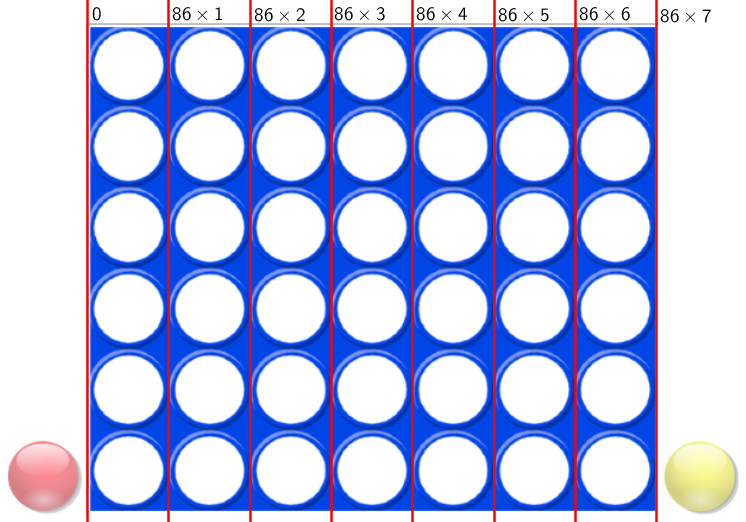

% Le jeu de puissance 4 : Programmation web en Python 
% Étape 4 : Positionnement des pions dans la grille
% Seconde - 2ISN

À l'étape précédente, nous avons permis le déplacement des pions, mais leur positionnement dans la grille n'est pas encore possible.

# La fonction `positionne_pion`

Observons le code de la fonction `drop` : 

<pre class="brush: python;">
def drop(ev):
	global pion_mobile
	print("drop")
	if deplacement_valide :
		resultat = positionne_pion(ev.x) 
		if resultat != "echec" :
			if pion_mobile == rouge :
				rouge.draggable = False
				jaune.draggable = True
				pion_mobile = jaune
				print("les rouges ont joué, c'est aux jaunes")
			elif pion_mobile == jaune :
				jaune.draggable = False
				rouge.draggable = True
				pion_mobile = rouge
				print("les jaunes ont joué c'est aux rouges")
	ev.preventDefault()
</pre>

À la ligne 5, la fonction `positionne_pion` appelée n'est pas encore définie. Cette fonction prend en argument le nombre `ev.x` égal à l'abscisse de point où le bouton de la souris est relâché lors du déplacement du pion. 

Le fonction `positionne_pion` doit :

- déterminer, à partir de la valeur de `ev.x`, dans quelle colonne le pion doit être joué ;
- déterminer où dessiner le pions dans la colonne considérée, en fontion des pions qui sont déjà dessinés dans la colonne.

Étudions ces deux problèmes séparément.

# Détermination de la colonne jouée

Le nombre `ev.x` est égal à l'abscisse de point où le bouton de la souris est relâché lors du déplacement du pion. Mais dans quel repère ? Par rapport à quelle origine ?

Nous avons dans notre page HTML deux systèmes de coordonnées différents (deux repères différents) : 

- l'un repère les points dans toute la page affichée ; son origine est située dans le coin en haut à gauche de la page ;
- l'autre repère les points **à l'intérieur du canvas** ; son origine est située dans le coin en haut à gauche **du canvas**.

Or l'abscisse `ev.x` retournée par le système au moment du relâchement du bouton de la souris est relative au **repère de la page affichée** alors que la fonction `drawImage` (qui sera utilisée pour dessiner le pion au bon endroit) prend en paramètre les coordonnées dans le **repère du canvas**.

La figure ci-dessous illustre la situation. Elle va aussi nous aider à résoudre ce problème.

Comment passer des coordonnées dans le repère rouge aux coordonnées dans le repère vert ?

Pour y arriver, nous avons accès à plusieurs grandeurs utiles : 

- la largeur en pixel de la fenêtre est donnée par le commande `document.documentElement.clientWidth` ;
- la largeur en pixels du canvas est donnée par `canvas.width` ;
- enfin, on sait que le canvas est centré dans la page.

On peut donc compléter le schéma comme ci-dessous. On a simplifié les notations en notant `W=document.documentElement.clientWidth` et `cW=canvas.width`.

M est un point de la fenêtre, d'abscisse \\(X\\) dans le repère de la fenêtre et \\(x\\) dans le repère du canvas.

On peut déduire du schéma le calcul suivant : $X=x+\frac{W-cW}{2}$ et donc $x=X-\frac{W-cW}{2}$.

Nous allons donc commencer à écrire notre fonction `positionne_pion` en programmant ce petit calcul permettant d'obtenir l'abscisse du point où le bouton de la souris est relâche **dans le repère du canvas**.

<pre class="brush: python;">
def positionne_pion(x):
	""" x représente l'abscisse du point
	où le bouton de la souris est relâché"""
	largeur_ecran = document.documentElement.clientWidth
	largeur_plateau = canvas.width
	x = x-(largeur_ecran - largeur_plateau)/2
</pre>

Il faut maintenant déterminer à quelle colonne correspond cette abscisse.

L'image du plateau est une image dont la largeur est fixe, égale à 602 pixels. Cette image est divisée en 7 colonnes de 86 pixels.

Nous pouvons donc définir une fonction `detecte_colonne` qui retourne le numéro de la colonne dans laquelle le bouton a été relâché en fonction de $x$ :

<pre class="brush: python;">
def detecte_colonne(x):
	if x < 86 :
		return 0
	elif x < 86*2:
		return 1
	elif x < 86*3:
		return 2
	elif x < 86*4:
		return 3
	elif x < 86*5:
		return 4
	elif x < 86*6:
		return 5
	elif x < 86*7:
		return 6
</pre>

Nous ajoutons ensuite une ligne supplémentaire à la fonction `positionne_pion` :

<pre class="brush: python;">
def positionne_pion(x):
	""" x représente l'abscisse du point
	où le bouton de la souris est relâché"""
	largeur_ecran = document.documentElement.clientWidth
	largeur_plateau = canvas.width
	x = x-(largeur_ecran - largeur_plateau)/2
	colonne = detecte_colonne(x)
</pre>

# Positionnement du pion dans la colonne

Nous savons maintenant dans quelle colonne le pion doit être positionné.

Pour le dessiner, il faut maintenant savoir combien de pions sont déjà entassés dans cette colonne. Il est donc nécessaire de conserver dans le programme une "mémoire" de l'état du plateau à chaque instant du jeu.

Nous allons pour cela définir une **variable** `grille` sous la forme d'un tableau de nombres entiers, avec la convention de remplissage suivante : 

- une case vide est codée par la valeur $0$ ;
- une case contenant un pion rouge est codée par la valeur $1$ ;
- une case contenant un pion jaune est codée par la valeur $-1$ ;

Pour définir un tel tableau, on entre le code suivant dans le fichier `puisance4.py` : la grille de départ est vide, la variable `grille` ne contient donc que des $0$.

<pre class="brush: python;">
### Représentation interne de la grille de jeu
grille = [ [0, 0, 0, 0, 0, 0, 0] ,
		   [0, 0, 0, 0, 0, 0, 0] ,
		   [0, 0, 0, 0, 0, 0, 0] ,
		   [0, 0, 0, 0, 0, 0, 0] ,
		   [0, 0, 0, 0, 0, 0, 0] ,
		   [0, 0, 0, 0, 0, 0, 0] ]
</pre>

Voici maintenant la fonction `dessine_pion` qui dessinera le pion au bon endroit :

<pre class="brush: python;">
def dessine_pion(col):
	""" Dessine le pion dans la colonne col
	si elle n'est pas pleine """
	# On vérifie que la colonne n'est pas pleine
	if grille[5][col] != 0:
		alert("La colonne est pleine !!!")
		return "echec"
	else:
		# On détermine la première ligne non-vide
		i = 0
		while grille[i][col] != 0:
			i = i+1
		# On met à jour la grille et on dessine le pion
		if pion_mobile == rouge:
			grille[i][col] = 1
			context.drawImage(rouge,85.5*col+5,85.5*(5-i)+5,80,80)
		elif pion_mobile == jaune:
			grille[i][col] = -1
			context.drawImage(jaune,85.5*col+5,85.5*(5-i)+5,80,80)
		return "reussi"
</pre>

----------------------------------

**Explications :**

- Les lignes 5 et 6 permettent d'afficher une petite fenêtre d'erreur si le joueur essaie de jouer dans une colonne qui est déjà pleine. Remarquons que l'instruction `grille[5][col]` correspond à la sixième ligne de la variable `grille` et à **la ligne du haut** du plateau.
- Les lignes 10, 11 et 12 recherchent la première ligne non-vide dans la colonne : une case non vide a en effet un contenu différent de 0.
- Dans les lignes 14 à 19, suivant la couleur du pion mobile, on met à jour la variable `grille` avec un $1$ ou un $-1$ et on utilise la fonction `drawimage` pour dessiner le pion au bon endroit. 

--------------------------------------

Pour finir, on complète à nouveau la fonction `positionne_pion` comme suit :

<pre class="brush: python;">
def positionne_pion(x):
	""" x représente l'abscisse du point
	où le bouton de la souris est relâché"""
	largeur_ecran = document.documentElement.clientWidth
	largeur_plateau = canvas.width
	x = x-(largeur_ecran - largeur_plateau)/2
	colonne = detecte_colonne(x)
	if dessine_pion(colonne) == "echec" :
		return "echec"
</pre>

Tester la page HTML : à ce stade, il est déjà possible de jouer ! Mais le programme ne détecte pas si un des deux joueurs a gagné ...

<nav>
<ul class="pager">
<li><a href="./puissance4_3.php">Étape précédente</a></li>
<li><a href="./puissance4_5.php">Étape suivante</a></li>
</ul>
</nav>