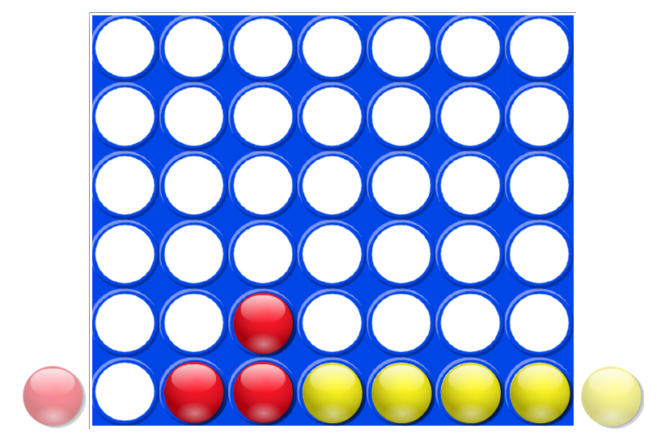
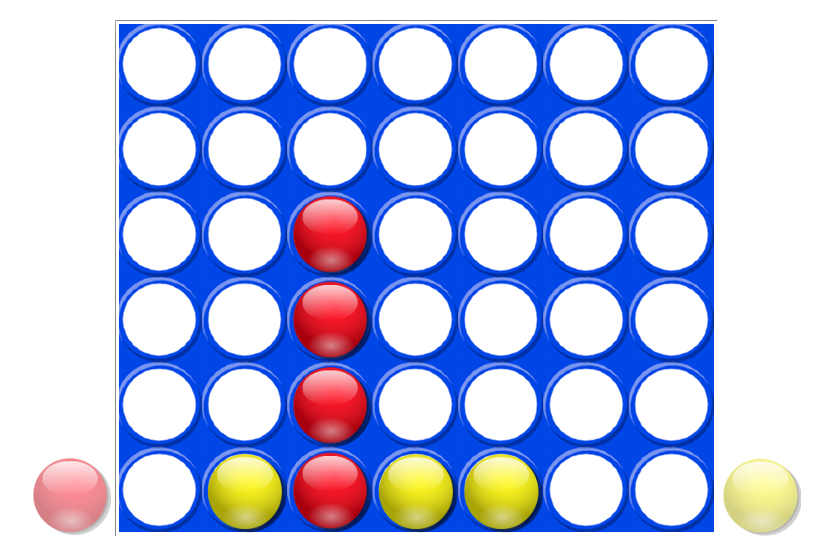
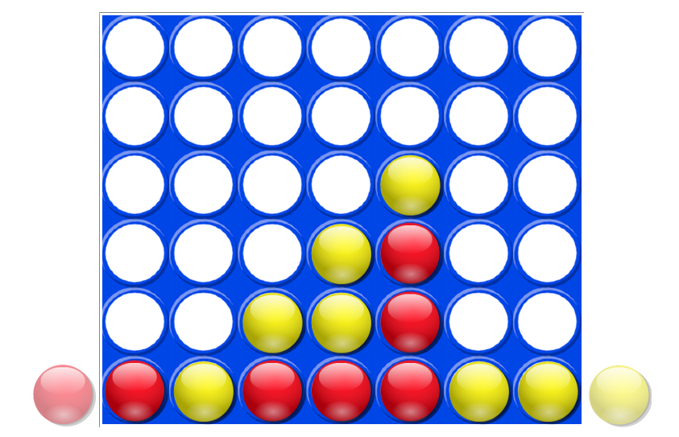
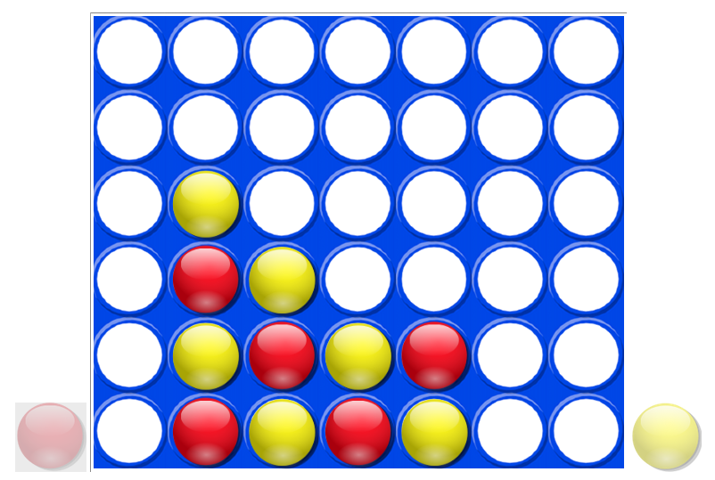

% Le jeu de puissance 4 : Programmation web en Python 
% Étape 5 : Vérification de la grille
% Seconde - 2ISN

Notre problème est donc maintenant de programmer un algorithme capable de tester une grille de jeu et de détecter une position gagnante.

# Les différentes positions gagnantes

Comme l'indiquent les figures ci-dessous, la victoire peut être obtenue par un alignement horizontal, vertical ou en diagonal de quatre pions de la même couleur.

Pour les besoins de l'algorithme, nous allons différencier les diagonales "montantes" et les diagonales "descendantes".

# Détection algorithmique de l'alignement de quatre pions de la même couleur

Pour comprendre le fonctionnement de l'algorithme, observons à nouveau le code de la fonction `dessine_pion` car c'est dans cette fonction que l'on met à jour le contenu de la variable globale `grille` qui **représente numériquement** le tableau de jeu dans le fichier Python.

<pre class="brush: python; highlight: [15, 18]">
def dessine_pion(col):
	""" Dessine le pion dans la colonne col
	si elle n'est pas pleine """
	# On vérifie que la colonne n'est pas pleine
	if grille[5][col] != 0:
		alert("La colonne est pleine !!!")
		return "echec"
	else:
		# On détermine la première ligne non-vide
		i = 0
		while grille[i][col] != 0:
			i = i+1
		# On met à jour la grille et on dessine le pion
		if pion_mobile == rouge:
			grille[i][col] = 1
			context.drawImage(rouge,85.5*col+5,85.5*(5-i)+5,80,80)
		elif pion_mobile == jaune:
			grille[i][col] = -1
			context.drawImage(jaune,85.5*col+5,85.5*(5-i)+5,80,80)
		return "reussi"
</pre>

Aux lignes 15 et 18, on affecte une valeur à l'élément `grille[i][col]` de la variable `grille` : $1$ si le pion joué est rouge et $-1$ si le pion joué est jaune.

On aura donc un alignement de quatre pions rouges si les quatre cases correspondantes de la grille contiennent toutes la valeur $1$, et donc si **leur somme** est égale à 4.

De même, on aura un alignement de quatre pions jaunes si les quatre cases correspondantes de la grille contiennent toutes la valeur $-1$, et donc si **leur somme** est égale à $-4$.

-------------------------------------------

Nous sommes maintenant en mesure de comprendre la fonction suivante : 

<pre class="brush: python;">
def verifie_gagne():
	"""Cette fonction retourne True si le dernier joueur
	qui a joué a gagné, False sinon.
	En cas de victoire, elle affiche un message."""
	gagnant=""
	### Vérification des alignements horizontaux ###
	for i in range(6):
		for j in range(4):
			if grille[i][j] + grille[i][j+1] + grille[i][j+2] + grille[i][j+3] == 4:
				gagnant = "Rouges"
			if grille[i][j] + grille[i][j+1] + grille[i][j+2] + grille[i][j+3] == -4:
				gagnant = "Jaunes"
	### Vérification des alignements verticaux ###
	for j in range(7):
		for i in range(3):
			if grille[i][j] + grille[i+1][j] + grille[i+2][j] + grille[i+3][j] == 4:
				gagnant = "Rouges"
			if grille[i][j] + grille[i+1][j] + grille[i+2][j] + grille[i+3][j] == -4:
				gagnant = "Jaunes"
	### Vérification des diagonales montantes ###
	for i in range(3):
		for j in range(4):
			if grille[i][j] + grille[i+1][j+1] + grille[i+2][j+2] + grille[i+3][j+3] == 4:
				gagnant = "Rouges"
			if grille[i][j] + grille[i+1][j+1] + grille[i+2][j+2] + grille[i+3][j+3] == -4:
				gagnant = "Jaunes"
	### Vérification des diagonales descendantes ###
	for i in range(3):
		for j in range(3,7):
			if grille[i][j] + grille[i+1][j-1] + grille[i+2][j-2] + grille[i+3][j-3] == 4:
				gagnant = "Rouges"
			if grille[i][j] + grille[i+1][j-1] + grille[i+2][j-2] + grille[i+3][j-3] == -4:
				gagnant = "Jaunes"
	### Affichage du gagnant ###
	if gagnant != "":
		alert('Les ' + gagnant + 'ont gagné !!!')
		return True
	else:
		return False
</pre>

# Mise en place de la vérification

La vérification doit être faite à chaque fois qu'un joueur joue un pion. Nous allons donc faire appel à la fonction `verifie_gagne` à l'intérieur de la fonction `positionne_pion` créée précédemment.

Nous modifions également cette fonction `positionne_pion` afin qu'elle ne s'exécute que si personne n'a encore gagné : c'est le rôle de la ligne 5. Pour cela, on utilise la variable globale `jeu_fini` et on change éventuellement sa valeur.

<pre class="brush: python;">
def positionne_pion(x):
	""" x représente l'abscisse du point
	où le bouton de la souris est relâché"""
	global jeu_fini
	if not jeu_fini :
		largeur_ecran = document.documentElement.clientWidth
		largeur_plateau = canvas.width
		x = x-(largeur_ecran - largeur_plateau)/2
		colonne = detecte_colonne(x)
		if dessine_pion(colonne) == "echec" :
			return "echec"
		if verifie_gagne() == True:
			rouge.draggable = False
			jaune.draggable = False
			alert("Le jeu est terminé ...\n Pour rejouer, recharger le page (F5)")
			jeu_fini = True
</pre>

------------------------------------------------------

Le jeu est maintenant complètement fonctionnel et peut être testé.

Le programme doit annoncer la couleur du vainqueur le cas échéant ... Testez par vous même !

Mais au fait, qui commence ? Les rouges ou les jaunes ?

Pour éviter des disputes, il faut encore (un peu) travailler ...
 
<nav>
<ul class="pager">
<li><a href="puissance4_4.php">Étape précédente</a></li>
<li><a href="puissance4_6.php">Étape suivante</a></li>
</ul>
</nav>