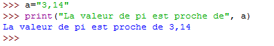

% Le jeu de puissance 4 : Programmation web en Python 
% Étape 7 : La fonction `print`
% Seconde - 2ISN

Nous connaissons la fonction `print()` dans le langage Python. Elle permet par exemple d'afficher une chaîne de caractère ou le contenu d'une variable dans la console Python, comme par exemple sur la capture d'écran ci-dessous.

Cette fonction `print()` est  présente à de nombreuses reprises dans le code du fichier `puissance4.py`, mais elle ne provoqie aucun affichage dans le navigateur.

Voici par exemple le code de la fonction `deplacement_rouge()` :

<pre class="brush: python; highlight: 3">
def deplacement_rouge(ev):
	global deplacement_valide
	print("deplacement rouge")
	if pion_mobile ==rouge:
		ev.dataTransfer.effectAllowed = 'move'
		deplacement_valide = True
	else :
		deplacement_valide = False
</pre>

Alors pourquoi l'avoir utilisée ???

<nav>
<ul class="pager">
<li><a href="puissance4_6.php">Étape précédente</a></li>
</ul>
</nav>