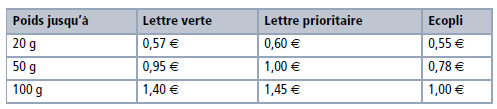

% Premiers pas en python 
% Spécialité ISN - Terminale S

L'objectif de ce travail est de connaître en python toutes les structures algorithmiques étudiées depuis la seconde en cours de mathématiques.

Vous testerez chacune des commandes présentées dans une console python.

# Entrées et sorties

<pre class="brush: python">
input("Quel est votre prénom ?")
prenom=input("Quel est votre prénom ?")
print("Bonjour ",prenom," ! ")
</pre>

Que se passe-t-il exactement lors de l’exécution du programme précédent ?

# Affectation de variables
 
Tester et expliquer :

<pre class="brush: python">
n=8
p=2.5
a=n*p
print(a)
p=6
print(a)
</pre>

<pre class="brush: python">
a, b, c=3,2.5,100
print(a)
print(b)
print(c)
</pre>

# Types de variables
 
Les principaux types de variables en Python sont :

  * les entiers : type `int`. Ils supportent les opérations +, -, *, /, ** (puissance), // (division entière), % (reste de la division entière), `abs()` (valeur absolue).
  * les booléens sont des variables qui ne peuvent prendre que deux valeurs : `False` ou `True`. Ils sont générés par les opérateurs de comparaison <, >, <=, >=, == (test d’égalité), != (test de différence) et les opérateurs logiques `not`, `or` et `and`.
  * les nombres flottants : type `float`. Ils supportent les opérations usuelles.
  * les chaînes de caractères : type `string`.
  * les listes : type `list`.

Observer le résultat des commandes suivantes :

<pre class="brush: python">
a=2012
print(type(a))
</pre>

<pre class="brush: python">
a=2012<=2013
print("a est égal à :",a,"et son type est :",type(a))
</pre>

<pre class="brush: python">
a=3.14   #le point est le séparateur décimal
print(type(a))
</pre>

<pre class="brush: python">
a=input("Entrer un nombre entier")
print("a est égal à :",a,"et son type est :",type(a))
</pre>

Expliquer le résultat.

Observer ce qui se passe maintenant :

<pre class="brush: python">
a=int(input("Entrer un nombre entier"))
print("a est égal à :",a,"et son type est :",type(a))
</pre>

<pre class="brush: python">
a=float(input("Entrer un nombre flottant"))
print("a est égal à :",a,"et son type est :",type(a))
</pre>

<pre class="brush: python">
a=["stylo","compas","équerre","calculatrice"]
print("a est égal à :",a,"et son type est :",type(a))
print(a[0])
print(a[2])
print(a[0:2])
</pre>

# Instructions conditionnelles

Un exemple : observer, tester et commenter.

<pre class="brush: python">
a = 2
if a > 0 :
     print("a est positif")
elif a < 0 :
     print("a est négatif")
else:
     print("a est nul")
</pre>

**Exercice 1**

Écrire un programme qui demande le poids, en grammes, d’une lettre prioritaire et qui retourne le prix du timbre adéquat.

**Exercice 2**

Écrire un programme qui résout une équation du second degré dont les coefficients a, b et c sont entrés par l’utilisateur.

# Instruction répétitives

Un exemple : observer, tester et commenter.

<pre class="brush: python">
a = 0
while (a < 7): # (n’oubliez pas le double point !)
     a = a + 1 # (n’oubliez pas l’indentation !)
     print(a)
</pre>

Un autre exemple : 

observer, tester et commenter.

<pre class="brush: python">
for i in range(20):
     print(i)

for i in range(5,20):
     print(i)
for i in range(5,20,2):
     print(i)

for lettre in "ciao":
     print(lettre, end=" ")
</pre>

**Exercice 3**

Écrire un programme qui affiche les 20 premiers termes de la table de multiplication par 6 (utiliser une instruction `while`).

**Exercice 4**

Écrire un programme qui affiche un tableau de valeurs pour la fonction $f : x\mapsto x^2-2 x-2$. L’utilisateur choisit la première valeur de $x$, le pas, ainsi que le nombre de valeurs à calculer (utiliser une boucle `for`).

