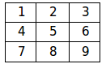

% Python : listes et tableaux
% Spécialité ISN - Terminale S
% Approfondissement sur la gestion des listes

# Listes simples

## Créer une liste

* Par simple affectation de valeurs :

<pre class="brush:python;">ma_liste = [2014, 'Python', 3.14]</pre>

* Par simple affectation d'une liste vide, qui sera remplie plus tard :
 
<pre class="brush:python;">ma_liste = []</pre>

* Par une définition sous forme de boucle (liste en compréhension) :

<pre class="brush:python;">
ma_liste = [2*k for k in range(10)]
ma_liste = [0 for k in range(10)]
</pre>

* Par la répétition d'un élément de base :

<pre class="brush:python;">ma_liste = [0]*10</pre>

## Accès aux éléments d'une liste

L'accès aux éléments d'une liste a déjà été présenté dans un cours précédent. Les éléments sont numérotés à partir de 0.

* Afficher le 2ème élément : 

<pre class="brush:python;">
>>> ma_liste = [2014, 'Python', 3.14]
>>> ma_liste[1]
'Python'
</pre>

## Modification d'une liste

* Modifier un élément préexistant :

<pre class="brush:python;">
>>> ma_liste = [2014, 'Python', 3.14]
>>> ma_liste[1] = 'Anaconda'
>>> ma_liste
[2014, 'Anaconda', 3.14]
</pre>

* Ajout d'un élément en fin de liste : 

<pre class="brush:python;">
ma_liste.append('Vacances')
ou
ma_liste = ma_liste + ['Vacances']
</pre>

## Parcours d'une liste

Par exemple pour afficher tous ses éléments un à un, deux versions équivalentes :

<pre class="brush:python;">
for k in range(len(ma_liste)) :
    print(ma_liste[k])
</pre>

	
<pre class="brush:python;">
for element in ma_liste :
    print(element)
</pre>

## Tester si un élément est présent dans une liste

* Pour tester si le nombre 2014 est dans la liste :

<pre class="brush:python;">
if 2014 in ma_liste :
    print(True)</pre>

## Autres opérations sur les listes

Voir [la fiche distribuée en début d'année](./pdf/memo_python_listes.pdf).

-----------------------------------

**Exercice 1**

Écrivez un programme qui recherche le plus grand élément présent dans une liste donnée. Par exemple, si on l’appliquait à la liste

<pre class="brush:python;">
[32, 5, 12, 8, 3, 75, 2, 15]
</pre>

ce programme devrait afficher :

<pre class="brush:python;">
le plus grand élément de cette liste a la valeur 75.
</pre>

---------------------------------------

**Exercice 2**

Soient les listes suivantes :

<pre class="brush:python;">
t1 = [31, 28, 31, 30, 31, 30, 31, 31, 30, 31, 30, 31]
t2 = ['Janvier', 'Février', 'Mars', 'Avril', 'Mai', 'Juin', 'Juillet', 'Août', 'Septembre', 'Octobre', 'Novembre', 'Décembre']</pre>

Écrivez un petit programme qui insère dans la seconde liste tous les éléments de la première, de telle sorte que chaque nom de mois soit suivi du nombre de jours correspondant : 

<pre class="brush:python;">['Janvier', 31, 'Février', 28, 'Mars', 31, etc.]</pre>

----------------------------------------------------

# Tableaux : listes à deux dimensions

Un tableau comme le tableau ci-dessous sera représenté en python par une liste de listes :

    

<pre class="brush:python;">mon_tableau = [[1, 2, 3], [4, 5, 6], [7, 8, 9]]</pre>

## Accès aux éléments du tableau

* Accès à un élément : 

<pre class="brush:python;">
>>> mon_tableau[1][2]
6
</pre>

* Accès à une ligne :

<pre class="brush:python;">
>>> mon_tableau[0]
[1, 2, 3]
</pre>

## Ajout d'une ligne : on ajoute une liste à la fin de la liste de listes

* Ajout d'une ligne : 

<pre class="brush:python;">
mon_tableau.append([10, 11, 12])
</pre>

## Parcours de tous les éléments d'un tableau

* Afficher tous les éléments d'un tableau

<pre class="brush:python;">
for i in range(len(mon_tableau)) :
    for j in range(len(mon_tableau[i])) :
        print(mon_tableau[i][j])
</pre>

---------------------------------

**Exercice 3**

Écrire un programme qui ajoute 1 à tous les éléments d'un tableau de nombres.

--------------------------------------

**Exercice 4**

Écrire un programme qui demande une valeur entière n, puis qui crée un tableau de n lignes et n colonnes dont tous les éléments valent 0.

