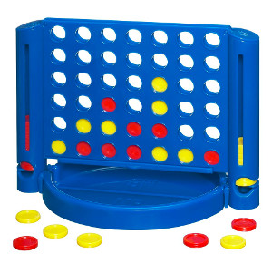

% Le jeu de puissance 4
%
%

# Présentation du jeu

Le jeu de puissance 4 est un jeu de plateau bien connu. Deux joueurs
s'affrontent autour d'une grille de 6 lignes et 7 colonnes dans laquelle
ils font glisser, chacun leur tour, des pions colorés.

Le gagnant est le premier joueur à aligner 4 de ses pions
horizontalement, verticalement ou en diagonale.

# Notre projet informatique

Le projet consiste à réaliser une page HTML permettant de jouer à Puissance 4.

Dans un premier temps, il s'agit de permettre à deux joueurs humains de s'affronter.

Les caractéristiques attendues pour la page HTML à réaliser sont les suivantes :

-   Le plateau de jeu est représenté sous forme graphique.
-   Les pions de deux couleurs différentes sont déplacés à la souris par les joueurs ; ils sont placés dans le plateau de jeu par glissé-déposé.
-   La page HTML indique à qui est le tour.
-   Un message apparaît en cas de victoire de l'un des deux joueurs.

Fonctionnalité complémentaire pouvant être étudiée dans un deuxième temps :

-   Possibilité de jouer contre l'ordinateur, avec plusieurs possibilités : l'ordinateur joue-t-il au hasard ou doit-il appliquer une stratégie gagnante éventuelle ?
