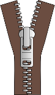
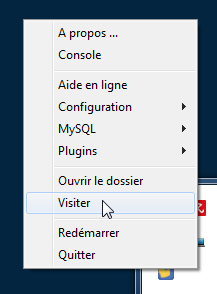

% Étape 2 : Mise en place de l'environnement de développement
%
% Seconde - 2ISN

Dans cette deuxième étape, nous allons installer et organiser notre espace de travail : dossiers, fichiers et logiciels nécessaires à la réalisation de notre projet.

# Quelques explications

Pour développer notre projet, plusieurs logiciels sont nécessaires :

-   Un navigateur internet, de préférence Firefox, doit être disponible pour tester la page HTML du jeu.
-   L'éditeur de texte Notepad ++ sera utilisé pour écrire le code HTML et le code Python du jeu.
-   Un serveur web est nécessaire pour faire le lien entre le code Python et la page web : le serveur utilisé sera le logiciel ZazouMiniWebServer.

# Téléchargement de l'environnement de développement

Afin de mettre tout cela en place, il suffit de télécharger l'archive ZIP en cliquant ci-dessous (le fichier ce trouve aussi sur le serveur du lycée, dans le lecteur `classe\votre_classe\nom_prenom\Projet 2ISN\`):

Cette archive doit ensuite être décompressée : un dossier "Projet 2ISN" est créé.

Le dossier décompressé contient trois sous-dossiers et un exécutable :

L'exécutable `ZMWSPortable.exe` est le serveur web portable qui fonctionne sans installation et sans réglage particulier. Voir cette section pour l'utilisation de ZMWSPortable : [utilisation de ZMWSPortable](#utilisation-du-zazouminiwebserver)

Le dossier `Other` et `Data` contiennent des fichiers techniques
nécessaires au fonctionnement de ZMWS : nous n'aurons pas besoin d'y
toucher.

Le dossier `App` contient deux sous-dossiers `AppInfo` et `ZMWS` : seul
ce dernier nous est utile. Il contient beaucoup de sous-dossiers et de
fichiers, mais c'est le sous-dossier `_web.zmwsc` dans lequel nous
allons toujours travailler.

Ce dossier contient un ficher HTML : c'est ce fichier que nous allons éditer et qui contiendra notre jeu.

Dans ce dossier, à côté du fichier HTML, télécharger et enregistrer les trois images suivantes, qui seront utilisées par le jeu : 

**Conseil** : Pour un accès plus rapide aux fichiers lors des séances suivantes, je vous conseille de : 
+ Créer sur le bureau un raccourci vers l'application ZMWSPortable. 
+ Créer sur le bureau un raccourci vers le dossier  `_web.zmwsc`.

# Utilisation du ZazouMiniWebServer

Pour chaque séance de travail sur le projet, la première chose à faire est de lancer le serveur web ZazouMiniWebServer en double cliquant sur l'icône créé sur le bureau.

Le système affiche éventuellement plusieurs avertissements de sécurité auxquels il faut répondre positivement.

Une fois le serveur lancé, son icône apparaît dans la zone des notifications (en bas à droite).

Faire un clic droit sur cet icône et choisir "Visiter" pour ouvrir dans le navigateur Internet le fichier `index.html`.

# Édition des document HTML et Python

Pour coder notre jeu, nous utiliserons deux fichiers :

+ le fichier `index.html` contiendra le code HTML nécessaire à l'affichage de la page dans le navigateur ; 
+ le fichier `puissance4.py` contiendra le code Python du jeu.

Ces deux fichiers seront édités dans le logiciel *notepad++*.

A chaque modification de l'un des deux fichiers, pour observer l'effet de la modification, on veillera à : 

1. Enregistrer les deux fichiers.
2. Rafraîchir l'affichage de la page web dans le navigateur (touche F5).
